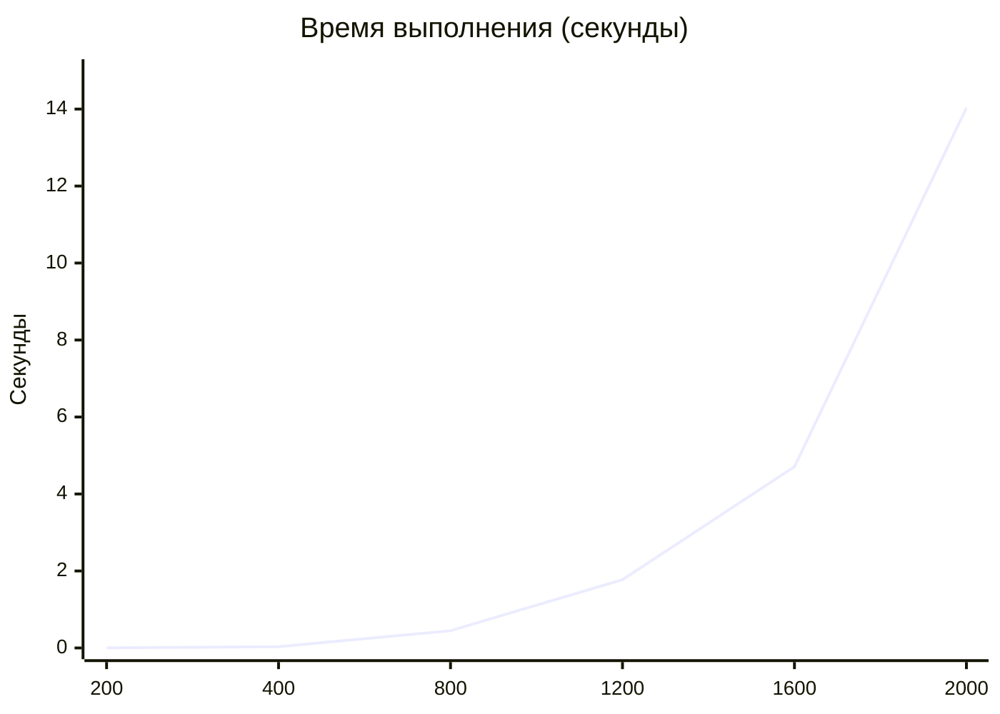
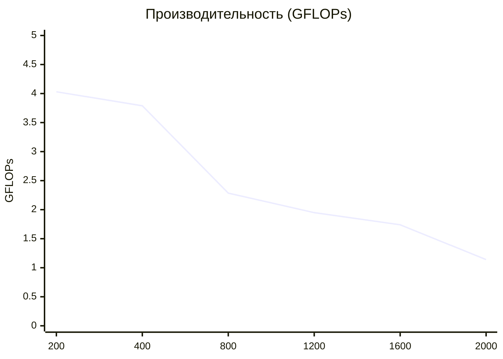

# Лабораторная работа №1: Перемножение матриц

Реализация последовательного алгоритма перемножения квадратных матриц ($O(N^3)$) на C++20 с автоматической верификацией результатов в Python (NumPy).

## 1. Характеристики вычислительной системы

* **Процессор (CPU):** 13th Gen Intel(R) Core(TM) i5-13420H
* **Операционная система:** Microsoft Windows 10 Pro x64 (сборка 10.0.19045)
* **Среда разработки:** Visual Studio / CMake (конфигурация `x64-Release`)
* **Компилятор C++:** MSVC (стандарт C++20)
* **Среда верификации:** Python 3.12 (NumPy 2.5.3)

---

## 2. Результаты экспериментов

| Размер N | Время (сек) | GFLOPs | Память (МБ) |
| :--- | :--- | :--- | :--- |
| 200 | 0.0040 | 4.0309 | 0.92 |
| 400 | 0.0338 | 3.7892 | 3.66 |
| 800 | 0.4481 | 2.2851 | 14.65 |
| 1200 | 1.7733 | 1.9489 | 32.96 |
| 1600 | 4.7084 | 1.7399 | 58.59 |
| 2000 | 14.0318 | 1.1403 | 91.55 |

---

## 3. Графики производительности

### Зависимость времени выполнения от размера матрицы N

### Динамика вычислительной мощности (GFLOPs)

---

## 4. Анализ результатов

1. **Временная сложность:** График времени наглядно демонстрирует кубическую сложность $O(N^3)$. При увеличении $N$ в 2 раза (например, с 1000 до 2000) время выполнения увеличивается примерно в 8 раз.
2. **Падение производительности (GFLOPs):** С ростом размера матрицы наблюдается снижение удельной производительности с 4.03 до 1.14 GFLOPs. Это связано с промахами мимо кэш-памяти процессора (L1/L2/L3 Cache) при классическом обходе трёх циклов.
3. **Верификация:** Результаты всех 6 экспериментов были автоматически сверены со скриптом `verify.py`. Максимальное расхождение с NumPy составило $\approx 5.01 \times 10^{-7}$, что подтверждает корректность C++ реализации.